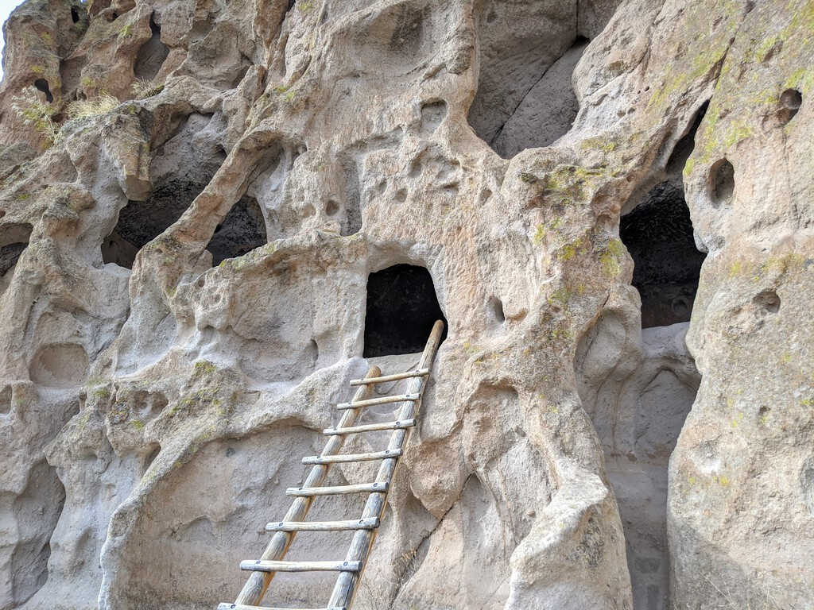

My original plan in New Mexico involves visting the 2 national parks and meeting some friends at Santa Fe. As I've quickly learned, plans in the time of coronavirus not only cannot be set in stone - they might as well be sands getting blown in the wind. So as the national parks closed and friend-meeting got cancelled, I grabbed onto the closest thing open near Albuquerque: Petroglyph & Bandalier National Monuments.

As luck has it, this unexpected turn of event set me down a 3 day journey to discover and learn about the history and incredible architecture of the ancestral Puebloans - a word I don't recall ever seeing before, not to mention knowing anything about. 
  
With spotty-or-non-existent internet along the way, I had the joy of discovering new information the old-fashioned way without the help of Google (or from all the closed visitor centers/museums due to coronavirus). It was like solving a puzzle: after seeing many ruins in different places, I started to notice similarities/unusual features, and missing pieces in one ruin would make a lot of sense after seeing the next ruin. After I visited the final stop of this journey, Mesa Verde National Park with its excellent explanatory signage, the puzzle pieces were coming together in a most satisfactory way. Such is the joy of making the best out of the unexpected!

Some highlights:
I came to Bandalier National Monument with zero expectation (only because it is open), so imagine my delight when I saw this at the end of a pleasant but unremarkable hike:

... or that I get to climb 3 tall ladders to reach a house perched in middle of a rock wall:

       
In truly middle of nowhere (after driving on some scarily bumpy unpaved road), a grand sight in Chaco National Historical Park:

And impressive setting for some impressive engineering in the form of cave dwellings (Cliff Palace, Mesa Verde):

This unexpected journey took me to southwestern Colorado. While I'm already here, I decided that I might as well drive along the scenic San Juan Skyway and soak in some mountain scenary, especially now that the Rocky Mountain National Park is closed.

While visiting the national parks and monuments, I've only seen at most a handful of cars and other visitors - and oftentimes I was the only one around - in spaces that are clearly designed to handle significantly more crowd. In my (clearly biased) worldview right now, completely shutting down national parks seem like an extreme reaction, instead of simply shuttering all lodging options to discourage crowd forming. Gloomy thoughts in my mind tonight as I found out that Yellowstone and Grand Teton are joining the ever growing list of closed places, but at least I have this starry night to comfort me:

