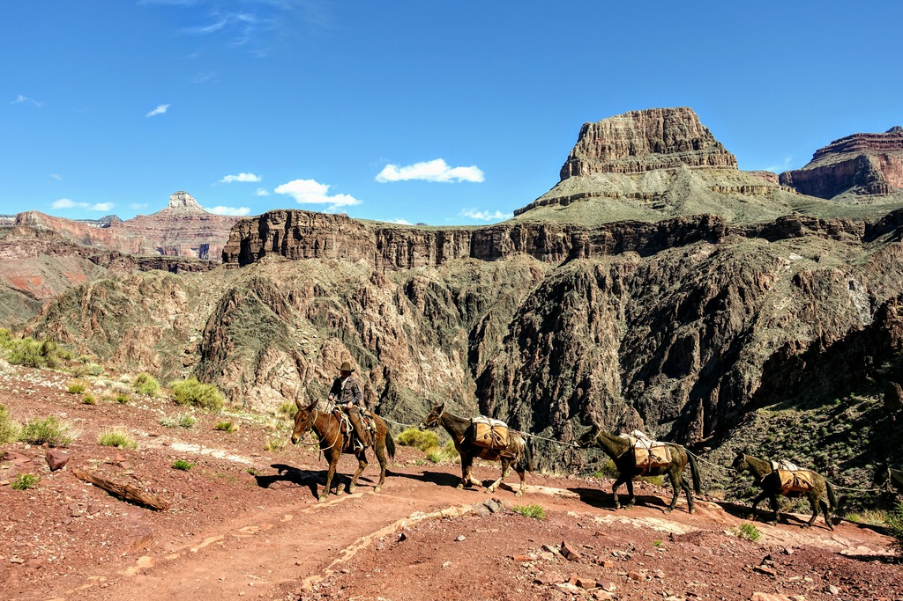

We went into the internet-less backcountry of Grand Canyon for 4 days, hiking from South Rim to North Rim and back. Like in the film _28 Days Later_, the world was quite different when we emerged back to the "normal world" with a barrage of news on the everything turning upside down.

Even while in the backcountry (where we saw only a handful of people after going beyond the day hiker's range), we saw inkling of events to come - in the onward journey we passed by [Phantom Ranch](https://www.grandcanyonlodges.com/lodging/phantom-ranch/) bustling with activities; on the return journey we found empty buildings with a stark written warning for park employees to "stay away [...] from anyone you do not know." Later, we found bulletins announcing closure of visitor centers, dining places, and shuttle bus system - all of which we just used 2 days ago. On our way back up the south rim, we passed by a ranger who turned awkwardly quiet as soon as we mentioned that we are from California.

Other than the gloomy backdrop of coronavirus affecting every aspect of our lives, the rim to rim to rim hike was amazing beyond my expectation. Every since I first saw the Grand Canyon from above, I've been itching to come back to experience it _for real_, by hiking down next to the canyon wall all the way down to the bottom.

We were incredibly lucky with our timing: a weather system moved in during our hike and dumped a large amount of water in the canyon. Instead of getting soaked with rain, we happened to be up at the north rim where temperature was below freezing. While the camping situation was challenging (my tent was probably permenantly twisted by more than a feet of snow weighting on it), we were rewarded by a magnificent hike down the the canyon coated in a thick layer of pristine fluffy snow. Not only was the view otherworldly, but also a delightful experience, with soft snow cushioning each down step. The mist gradually cleared up while we headed down, slowly revealing the landscape, completely transformed from what we've seen the previous day, with white accenting the fissures in the rocks.

I could not stop thinking about how _grand_ the Grand Canyon is during the entire 4 days. It was awe-inspring to see the canyon from above, stretching beyond sight on both ends and dropping to an almost nausea inducing depth; but I don't think I have fully appreciated the grandness until the rim to rim experience. At each point of the hike, the immediate surrounding was forbiddenly grand even though at each point of the hike, we could only see a small part of the canyon...

         

           

           

           

           

           

           

           

           

           

           

           

           

           

           

           

           

           

           

           

           

