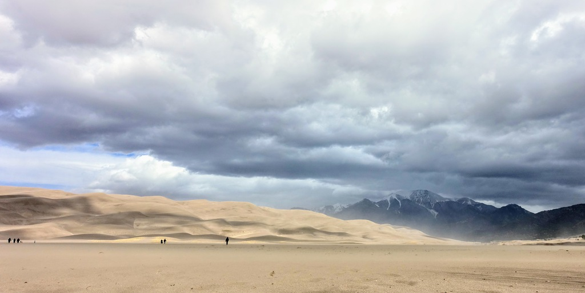
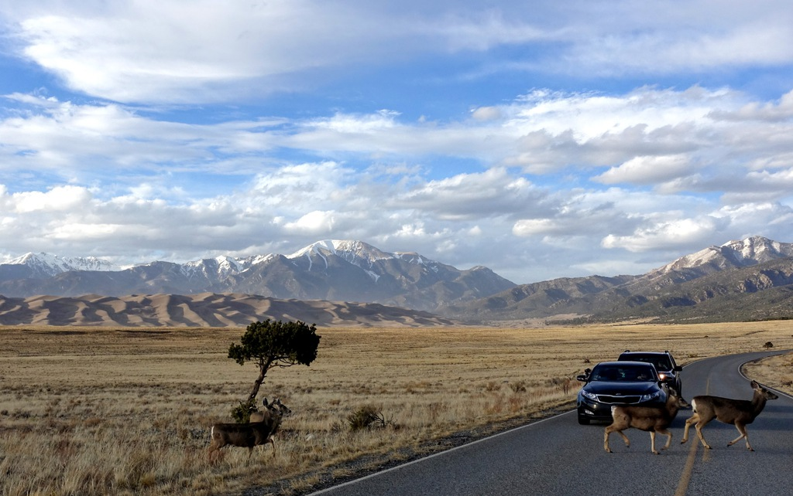

Next to the Rocky Mountains and the surrounding forests and creeks would probaby be the last place I would look for sand dunes, and yet nature loves to subvert expectation:

I was hoping to spend a night in backcountry camping in the dunes, but with wind gusting up to 55 mph - region was under high wind warning from national weather service - I gave up that plan. Even during the short trek from parking lot to the day use area of the dunes was quite painful, as the wind kept pelting small rocks and sands on my face. Instead I stayed in the frontcountry and got stopped by mule deers crossing the road:

With all state parks and even national forests within the state closing their campgrounds, I was eager to get out of Colorado - the hostility was clear. I was careful to maintain social distancing, albeit non-conventionally, but the rigid rules are not helpful (e.g. spending the night in my car in an almost empty campground would seem a lot safer than forcing me to stay at a hotel while passing through the state).

Today was my longest driving day yet, over 550 miles / 10 hours including pit stops. Except for a stressful section south of Denver full of trucks and construction lane changes, it was quite peaceful and meditative to drive through the slowly moving landscape, which morphed from snowy mountains and grassy foothills into expansive prairie from southern Colorado to Wyoming past Cheyenne.

One of my hopes for this trip was to appreciate the vastness of the United States, over the land that I so casually flew over many times on the airplane. Driving for hours on a mostly-empty road in the midst of non-ending moody and rainy prairie landscape of Wyoming / South Dakota was exactly what I've hoped for - it was a visceral experience of the vast expanse.

Stopped by Hot Springs, SD for the night - picked simply for being enroute to Mount Rushmore, though it seems to be a happening town during high season. I felt quite uncomfortably out of place in the gas station convenience store, even without any words being exchanged, and it was not easy to pinpoint why. Perhaps I felt self-conscious of being viewed as a potential COVID-19 bearer with my California license plate (though people in the store joked about 6 feet distancing, clearly not taking it seriously)? Or that everyone else in the store are clearly in the demographic of Trump voters? Or that I clearly do not fit in racially? Or that I'm clearly an outsider culturally - I don't pay by cash or drive a pickup truck like everyone else seems to do? Regardless, I'm glad that I had this experience of discomfort, as it is a teaching moment (of a lesson that I'm still trying figure out).

Tomorrow I'll head to Badlands National Park, and weather and logistics permitting, do the 2-day [Sage Creek Loop](https://www.backpacker.com/trips/rip-go-sage-creek-loop-badlands-national-park-sd) trail. This might be the last real stop before ending the trip by driving straight to Baltimore; coronavirus-closures are closing in (receptionist at the hotel tonight are convinced that they will close before next week)...
