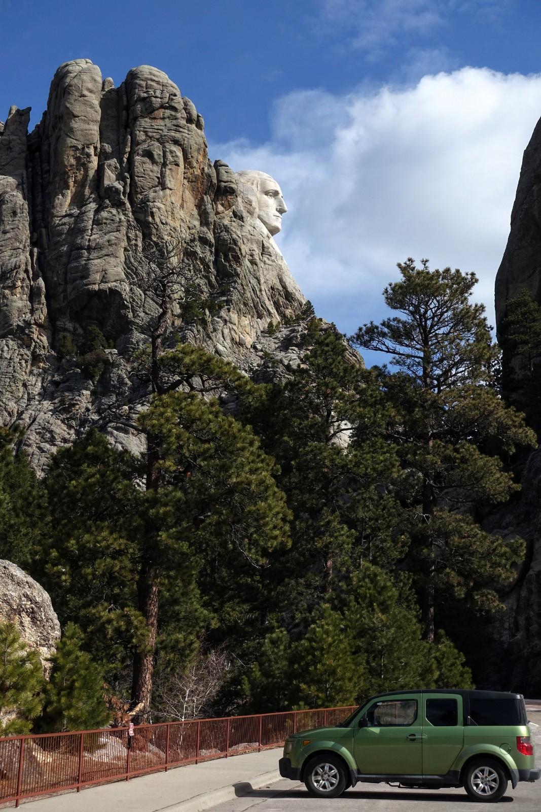
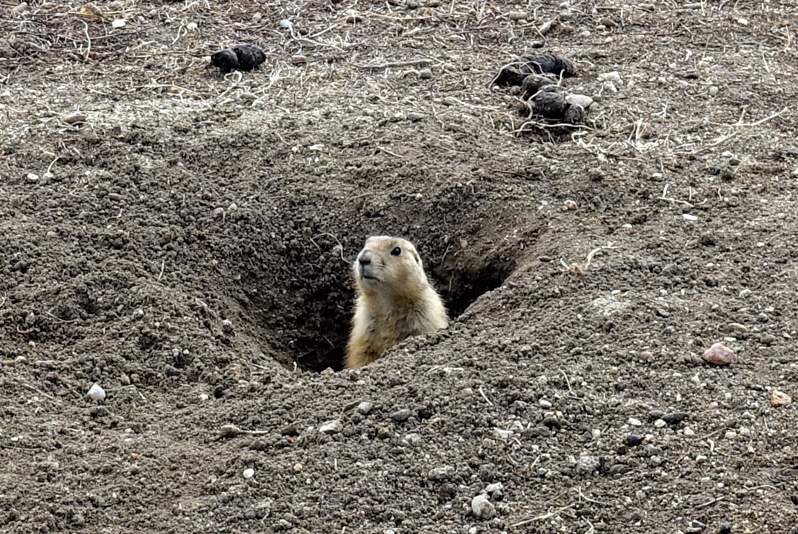
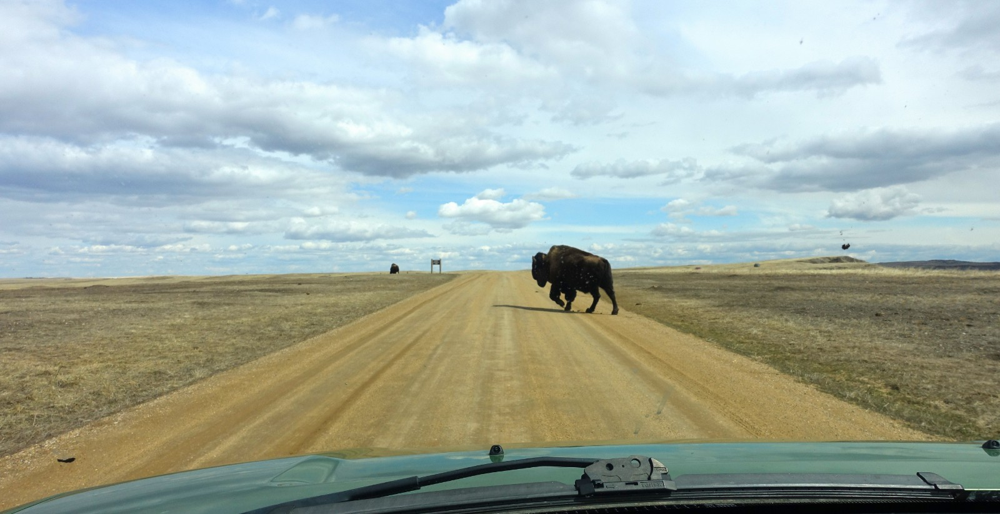
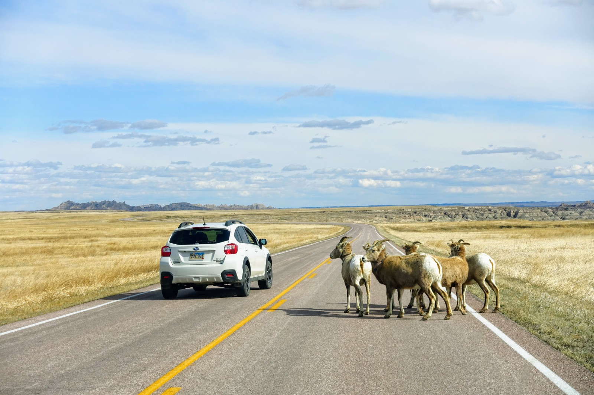
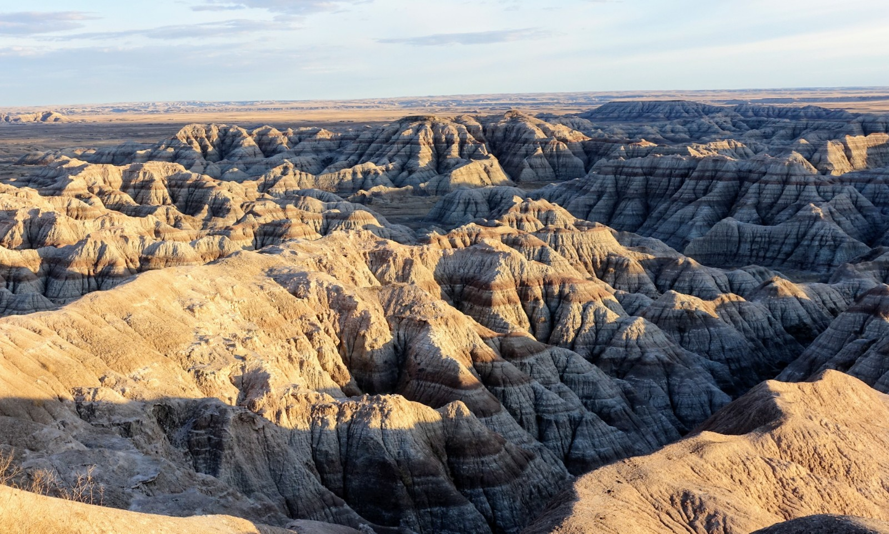
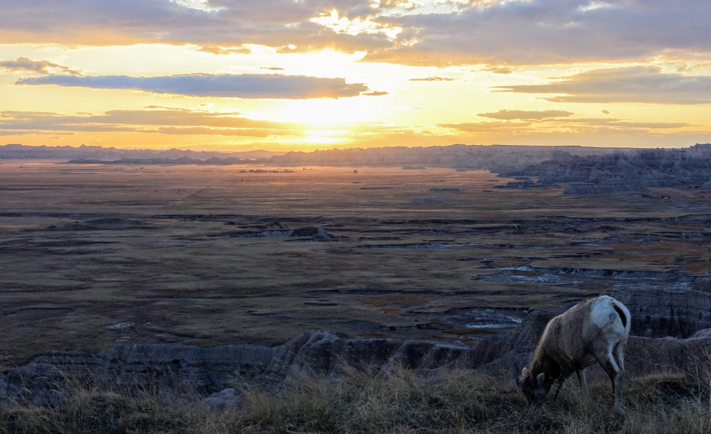

One cannot pass by South Dakota without visiting the iconic Mt Rushmore sculpture. I always thought it is a tourist trap, and spoiler... it is definitely one, though the surrounding Black Hill Forest is beautiful and the sculpture itself is quite impressive. It is rather incongruous to find in front of the sculptured mountain a large parking structure complete with toll booths (parking is currently temporarily free, thanks to COVID-19). One can only imagine what a crowded place this can be, though I only saw a handful of brave souls. In lieu of cliche picture of Mt Rushmore, here is Washington's head in profile overlooking my trusty car:

2 hours of driving later, I was at the other attraction of South Dakota: the Badlands. Google Maps took me into the park via the less popular entrance on an unpaved road, but all was well: I encountered many prairie residents before I even got to the paved road part of th park.

My favorite is the prairie dogs. Apparently they are common elsewhere (e.g. Colorado) and can be a nuisance, but they are also adorable. Ever watchful of danger, some of them insist on standing by their hole the entire time I was watching them from my car:

Not far from the prairie dog colony, I encountered a pair of grazing bison, one of them leisurely trot across the road:

Numerous bighorn sheep were grazing by the road as well. They don't seem to care about cars at all, often taking on the attitude of "well I like to stand on this road - you are welcome to drive around me"

I came to the Badlands National Park to see the titular badlands; seeing wildlife was a pleasant surprise. The badlands didn't disappoint either:

And they look spectacular at sunset:

I did not end up doing the 2-day backpacking trip. The trail seems muddy from the recent rain, and more concerningly, Trump's comment about potential quarantine of New York spook me on the possibility that I may be stuck in a strange place for a long time  - an adventure that I'm not yet ready for.
