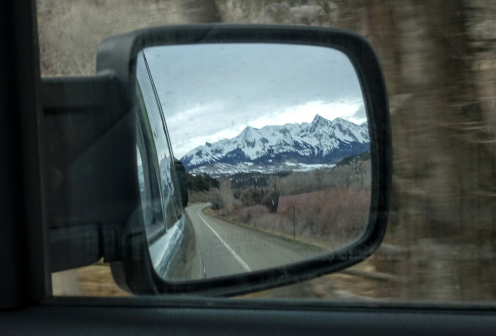

Today I drove along the scenic San Juan Skyway in Colorado, passing by the mountain towns of Rico, Ridgway, Ouray, Silverton, and Durango. Gorgeous mountains in full-blown winter coat dominate much of the landscape, including that in my rearview mirror:

Dotted along the road were access points to San Juan National Forest for skiing, hiking, ... Such teasing! I would love to come back and explore with some backcountry skiing gear, perhaps in a different season, and without stark roadside warnings on avoiding backcountry recreation during COVID-19.

Just south of Silverton, traffic on both directions was stuck for almost 2 hours waiting for a crew to clean up on a flipped truck. In more "normal" time, I'd probably be anxious at such a delay (detour would involve at least 3 extra hours of backtracking). Instead, it was a happy reminder that I don't need to be in anywhere by any given time, and without any worry, I spent the stuck time enjoying the amazing mountain view from the comfort of my car while catching up on the news of the day.

Worth mentioning that I dutiful spent the day in complete social distancing in my car (didn't even need to fuel up!). While settling down for the night on BLM land away from town and people, I received a mobile alert from the governor of Colorado mandating shelter-in-place starting tomorrow - it seems likely that I will soon (and prematurly) say goodbye to Colorado...
