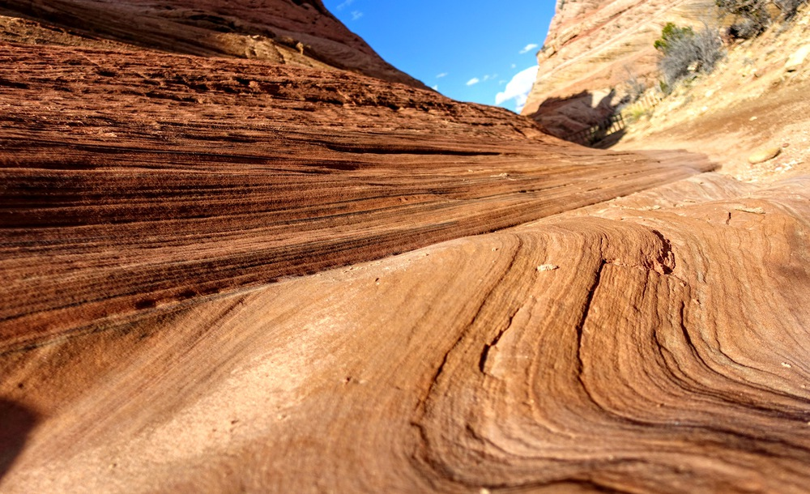
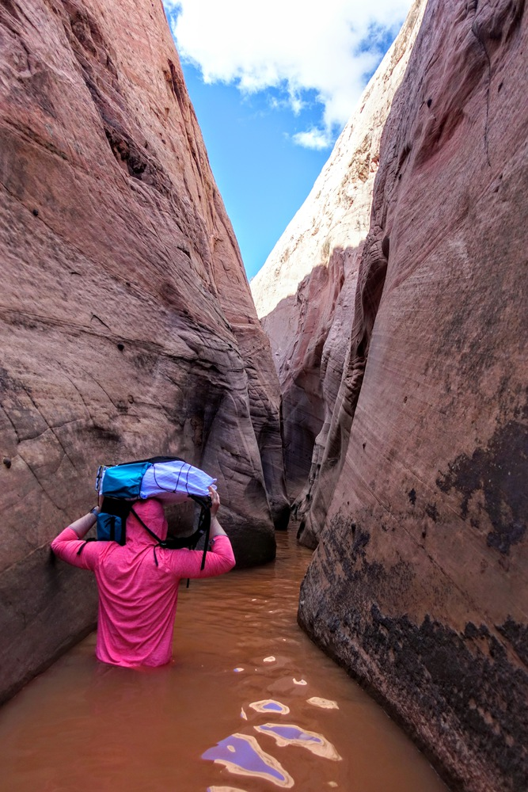
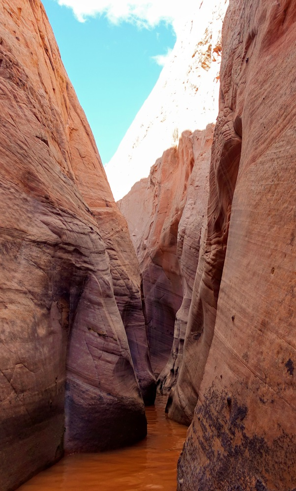
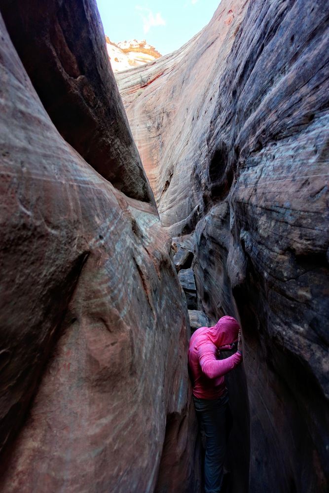

It was a nice respite from the gloom and doom to drive on Utah Highway 12 from Torrey to Bryce, through winter wonderland of snow-covered aspen groves dotting pristine snow fields near the mountain top, and through the incredibly colorful and expansive rocky landscape of Grand Staircase-Escalante National Monument.

We stopped for a hike to the Zebra Slot Canyon, just north of Escalate off the unpaved Hole-in-the-Rock road. I was a bit concerned about the unpaved road condition after the rain yesterday, but it turned out okay. We had just a tantalizing glimpse of the "Zebra" part of the slot canyon - the water level in the slot canyon was high, and we turned back about 50 ft beyond the canyon entrance, after wading through above-waist-high cold muddy water. Would love to come back and explore further, when the water level gets low enough so swimming is not required!

     

          
     

     

          
     

     

          
     

